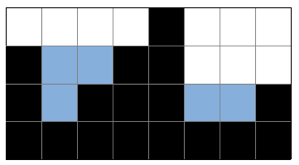

# Gold 5

## 문제
2차원 세계에 블록이 쌓여있다. 비가 오면 블록 사이에 빗물이 고인다.

비는 충분히 많이 온다. 고이는 빗물의 총량은 얼마일까?

## 입력
첫 번째 줄에는 2차원 세계의 세로 길이 H과 2차원 세계의 가로 길이 W가 주어진다. (1 ≤ H, W ≤ 500)

두 번째 줄에는 블록이 쌓인 높이를 의미하는 0이상 H이하의 정수가 2차원 세계의 맨 왼쪽 위치부터 차례대로 W개 주어진다.

따라서 블록 내부의 빈 공간이 생길 수 없다. 또 2차원 세계의 바닥은 항상 막혀있다고 가정하여도 좋다.

## 출력
2차원 세계에서는 한 칸의 용량은 1이다. 고이는 빗물의 총량을 출력하여라.

빗물이 전혀 고이지 않을 경우 0을 출력하여라.

## Thinking!!
일단 벽을 처음 만나면, 높이를 기록
그 다음 벽(땅이던 벽이던)을 만나면 비교, 더 낮으면 카운트만큼
(지금 벽 - 이전 낮았던 벽) * 카운트

그럼 당장 전에 가장 높았던 벽, 이전 낮았던 벽 두개를 저장하고
새로운 벽을 찾아야하나?

다시 생각해보면,

3이라는 벽을 만나. 그 후에 3턴 뒤에 다시 3을 만나
그러면 3 * 2 - (두 턴동안 만난 벽의 수) 하면 물의 값이 나오긴 함

근데 이렇게 가장 긴 것만 갱신하면 그보다 낮은 벽을 만나서 가뒀을 때
값이 갱신되지 않음. 최소값에서 벽이 높아질 때 마다 갱신해야함
