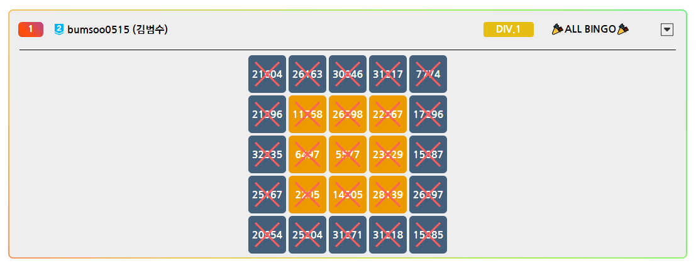

# Gold 3

## 문제
영과일에서는 방학 동안 학회원들을 대상으로 백준 빙고 이벤트를 진행한다. 이벤트 참가자들에게는 칸마다 백준 문제가 하나씩 배정된 
$5\times 5$ 격자 모양의 빙고판이 주어진다. 참가자들은 문제를 풀어서 빙고판의 칸을 색칠할 수 있고, 방학 기간이 끝날 때까지 일정 빙고 수 이상을 달성하면 추첨을 통해 상품을 받을 수 있다.

그런데 범수는 천천히 방학 동안 풀라고 주어진 빙고판을 이벤트 때마다 첫날에 스피드런해서 전부 채워버렸다.

백준 빙고 이벤트 첫날 랭킹에 보이는 모습.

이런 모습을 지켜보던 학회장은 범수에게 
$N\times N$ 격자 모양의 빙고판을 새로 만들어 주었다.

 
$N\times N$ 격자 모양의 빙고판에서 빙고 줄은 
$N$개의 행, 
$N$개의 열, 그리고 모서리에서 출발하는 대각선 
$2$개로 총 
$2N+2$개이다. 어떤 빙고 줄의 문제를 모두 풀면 그 줄은 완성되고, 완성된 빙고 줄이 
$k$개일 때 이를 
$k$빙고라고 부른다.

범수는 스피드러너답게 새로운 빙고판에서도 어김없이 바로 스피드런을 시작하려 한다. 범수가 새 빙고판의 
$i$행 
$j$열에 해당하는 문제를 푸는 데는 
$A_{ij}$ 만큼의 시간이 걸린다. 이에 따라 범수는 다음과 같은 스피드런 전략을 사용하기로 했다.

아직 완성되지 않은 줄 중, 완성하기 위해 필요한 시간이 가장 적은 줄을 선택한다.
어떤 빙고 줄을 완성하기 위해 필요한 시간은 그 줄에 있는 아직 풀지 않은 문제를 푸는 시간의 총합과 같다.
만약 필요한 시간이 가장 적은 줄이 여러 개라면, 다음 우선순위에 따라 가장 먼저 만족하는 줄을 선택한다.
후보에 행이 있다면 그중 행 번호가 가장 작은 행을 선택한다.
후보에 열이 있다면 그중 열 번호가 가장 작은 열을 선택한다.
후보에 왼쪽 위에서 오른쪽 아래로 향하는 대각선이 있다면 그 줄을 선택한다.
후보에 오른쪽 위에서 왼쪽 아래로 향하는 대각선이 있다면 그 줄을 선택한다.
선택한 줄에 남아 있는 풀지 않은 문제를 모두 푼다. 이때 문제는 어느 순서로 풀어도 상관없다.
문제는 동시에 하나씩만 풀 수 있고, 문제를 푸는 사이 쉬는 시간은 필요하지 않다.
학회장은 새 빙고판에서 범수가 
$k$빙고를 달성하는 데 시간이 얼마나 걸릴지 궁금해졌다. 모든 
$k$에 대해 그 시간을 구하는 프로그램을 작성해 보자.

## 입력
첫 번째 줄에 빙고판의 크기를 나타내는 정수 
$N$이 주어진다. 
$(1\le N\le 1\, 500)$ 

두 번째 줄부터 
$N$개의 줄에 걸쳐 각 줄마다 
$N$개의 정수가 공백으로 구분되어 주어진다. 
$i+1$번째 줄의 
$j$번째 정수 
$A_{ij}$는 범수가 빙고판의 
$i$행 
$j$열에 해당하는 문제를 푸는 데 걸리는 시간을 의미한다. 
$(1\le A_{ij}\le 10^{9})$ 

## 출력
 
$2N+2$개의 줄에 걸쳐 
$k$번째 줄에 처음으로 
$k$빙고 이상이 되었을 때 경과한 시간을 출력한다. 
$(1\le k\le 2N+2)$ 

## Thinking!
N = 5일 때, 
1행, 2행, 3행, 4행, 5행
1열, 2열, 3열, 4열, 5열
대각선 2개
-> 총 12줄

아직 완성이 안 된 줄 들 중, 시간 합이 가장 작은 줄을 고른다.

그 줄에 포함된 안 푼 문제들을 전부 푼다.

그 줄은 빙고 추가. -> 시간 누적

