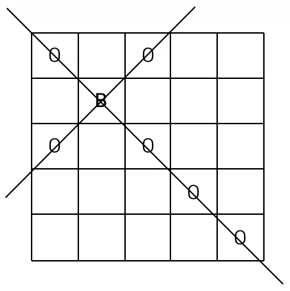
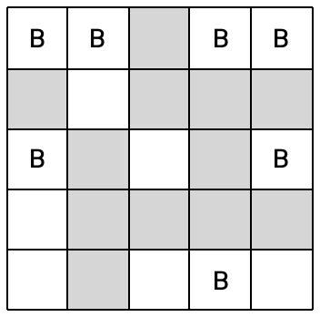

# Platinum 5

## 문제
서양 장기인 체스에는 대각선 방향으로 움직일 수 있는 비숍(bishop)이 있다. < 그림 1 >과 같은 정사각형 체스판 위에 B라고 표시된 곳에 비숍이 있을 때 비숍은 대각선 방향으로 움직여 O로 표시된 칸에 있는 다른 말을 잡을 수 있다.

< 그림 1 >

그런데 체스판 위에는 비숍이 놓일 수 없는 곳이 있다. < 그림 2 >에서 체스판에 색칠된 부분은 비숍이 놓일 수 없다고 하자. 이와 같은 체스판에 서로가 서로를 잡을 수 없도록 하면서 비숍을 놓는다면 < 그림 3 >과 같이 최대 7개의 비숍을 놓을 수 있다. 색칠된 부분에는 비숍이 놓일 수 없지만 지나갈 수는 있다.

< 그림 2 >

< 그림 3 >

정사각형 체스판의 한 변에 놓인 칸의 개수를 체스판의 크기라고 한다. 체스판의 크기와 체스판 각 칸에 비숍을 놓을 수 있는지 없는지에 대한 정보가 주어질 때, 서로가 서로를 잡을 수 없는 위치에 놓을 수 있는 비숍의 최대 개수를 구하는 프로그램을 작성하시오.

## 입력
첫째 줄에 체스판의 크기가 주어진다. 체스판의 크기는 10이하의 자연수이다. 둘째 줄부터 아래의 예와 같이 체스판의 각 칸에 비숍을 놓을 수 있는지 없는지에 대한 정보가 체스판 한 줄 단위로 한 줄씩 주어진다. 비숍을 놓을 수 있는 곳에는 1, 비숍을 놓을 수 없는 곳에는 0이 빈칸을 사이에 두고 주어진다.

## 출력
첫째 줄에 주어진 체스판 위에 놓을 수 있는 비숍의 최대 개수를 출력한다.

## Thinking!!
본문 코드는 pypy로는 통과되지 않음(메모리 이슈)

    import sys
    sys.setrecursionlimit(10**7)
    input = sys.stdin.readline
    
    N = int(input())
    board = [list(map(int, input().split())) for _ in range(N)]
    
    # \ 대각선 점유 체크: (i - j + N - 1)
    used_diff = [False] * (2 * N - 1)
    
    def solve(color):
        # color: 0(짝수), 1(홀수)  -> (i+j)%2
        best = 0
    
        # / 대각선(s = i+j)을 color에 맞게만 탐색:
        # s는 0..2N-2, 색이 고정되면 s의 parity가 고정됨
        start_s = color
        end_s = 2 * N - 2
    
        def dfs(s, cnt):
            nonlocal best
    
            # 남은 /대각선 개수로 가지치기 (대각선은 2씩 증가)
            remaining = ((end_s - s) // 2) + 1
            if cnt + remaining <= best:
                return
    
            if s > end_s:
                best = max(best, cnt)
                return
    
            # 이번 /대각선 s에서 놓을 수 있는 위치들을 시도 (최대 50개라 가벼움)
            placed = False
            i_start = max(0, s - (N - 1))
            i_end = min(N - 1, s)
    
            for i in range(i_start, i_end + 1):
                j = s - i
                if board[i][j] == 0:
                    continue
                d = i - j + (N - 1)
                if not used_diff[d]:
                    used_diff[d] = True
                    dfs(s + 2, cnt + 1)
                    used_diff[d] = False
                    placed = True
    
            # 이 /대각선에서 아예 안 놓는 경우도 필요
            dfs(s + 2, cnt)
    
        dfs(start_s, 0)
        return best
    
    # 흑/백 따로 풀고 합
    ans = solve(0) + solve(1)
    print(ans)
