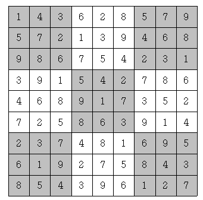

# Gold 4

## 문제
스도쿠는 매우 간단한 숫자 퍼즐이다. 9×9 크기의 보드가 있을 때, 각 행과 각 열, 그리고 9개의 3×3 크기의 보드에 1부터 9까지의 숫자가 중복 없이 나타나도록 보드를 채우면 된다. 예를 들어 다음을 보자.

위 그림은 참 잘도 스도쿠 퍼즐을 푼 경우이다. 각 행에 1부터 9까지의 숫자가 중복 없이 나오고, 각 열에 1부터 9까지의 숫자가 중복 없이 나오고, 각 3×3짜리 사각형(9개이며, 위에서 색깔로 표시되었다)에 1부터 9까지의 숫자가 중복 없이 나오기 때문이다.

하다 만 스도쿠 퍼즐이 주어졌을 때, 마저 끝내는 프로그램을 작성하시오.

## 입력
9개의 줄에 9개의 숫자로 보드가 입력된다. 아직 숫자가 채워지지 않은 칸에는 0이 주어진다.

## 출력
9개의 줄에 9개의 숫자로 답을 출력한다. 답이 여러 개 있다면 그 중 사전식으로 앞서는 것을 출력한다. 즉, 81자리의 수가 제일 작은 경우를 출력한다.

## 제한
12095번 문제에 있는 소스로 풀 수 있는 입력만 주어진다.
C++17: 180ms
Java 15: 528ms
PyPy3: 2064ms

## Thinking!!

### 1차 시도(시간 초과)
    import sys
    
    input = sys.stdin.readline
    
    sudoku = [list(map(int, input().rstrip())) for _ in range(9)]
    nums = [1,2,3,4,5,6,7,8,9]
    
    def find_next_empty(x, y):
        # (x,y)부터 순서대로 9×9 전체를 훑어서 0인 칸을 찾아서 리턴
        for i in range(x, 9):
            for j in range(9):
                if i == x and j < y:
                    continue
                if sudoku[i][j] == 0:
                    return i, j
        # (x,y) 이후에 빈 칸이 없으면 None, None 리턴
        return None, None
    
    def search(x, y):
        sn = set()
        block_x = (x // 3) * 3
        block_y = (y // 3) * 3
    
        for i in range(9):
            if sudoku[i][y] != 0:
                sn.add(sudoku[i][y])
    
        for i in range(9):
            if sudoku[x][i] != 0:
                sn.add(sudoku[x][i])
    
        for i in range(block_x, block_x+3):
            for j in range(block_y, block_y+3):
                if sudoku[i][j] != 0:
                    sn.add(sudoku[i][j])
    
        for num in range(1, 10):
            if num not in sn:
                sudoku[x][y] = num
    
                next_x, next_y = find_next_empty(x, y)
    
                if next_x is None:
                    for row in sudoku:
                        print("".join(map(str, row)))
                    sys.exit(0)
                else:
                    search(next_x, next_y)
    
                sudoku[x][y] = 0
    
    search(*find_next_empty(0, 0))

find_next_empty로 매번 9×9를 스캔해서 다음 빈칸을 찾는 것

한 칸에 넣을 수 있는 숫자를 검사할 때마다 sn = set() 만들고, 가로·세로·3×3 블록을 9개씩 훑어서 set에 넣는 것
이 두 이유 때문에 시간초과가 난다.

1. 빈칸 좌표를 미리 모아둔다.
2. 가로, 세로, 블록 검사를 최적화.