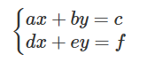

## 문제
수현이는 4차 산업혁명 시대에 살고 있는 중학생이다. 코로나 19로 인해, 수현이는 버추얼 학교로 버추얼 출석해 버추얼 강의를 듣고 있다. 수현이의 버추얼 선생님은 문자가 2개인 연립방정식을 해결하는 방법에 대해 강의하고, 다음과 같은 문제를 숙제로 냈다.

다음 연립방정식에서 
$x$와 
$y$의 값을 계산하시오.
    

4차 산업혁명 시대에 숙제나 하고 앉아있는 것보다 버추얼 친구들을 만나러 가는 게 더 가치있는 일이라고 생각했던 수현이는 이런 연립방정식을 풀 시간이 없었다. 다행히도, 버추얼 강의의 숙제 제출은 인터넷 창의 빈 칸에 수들을 입력하는 식이다. 각 칸에는 
$-999$ 이상 
$999$ 이하의 정수만 입력할 수 있다. 수현이가 버추얼 친구들을 만나러 버추얼 세계로 떠날 수 있게 도와주자.

## 입력
정수 
$a$, 
$b$, 
$c$, 
$d$, 
$e$, 
$f$가 공백으로 구분되어 차례대로 주어진다. (
$-999 \leq a,b,c,d,e,f \leq 999$)

문제에서 언급한 방정식을 만족하는 
$\left(x,y\right)$가 유일하게 존재하고, 이 때 
$x$와 
$y$가 각각 
$-999$ 이상 
$999$ 이하의 정수인 경우만 입력으로 주어짐이 보장된다.

## 출력
문제의 답인 
$x$와 
$y$를 공백으로 구분해 출력한다.

## Thinking!!
그니까 입력으로 ax + by = c, a b c가 순서대로 입력되고, 다음 d e f가 입력된다.
이 연립방정식의 x, y 값을 구하는 것이 풀이.

일반적인 연립방정식 푸는 방식으로 하면 될라나?

간단하게 하면, a랑 d의 최소공배수를 구하면 됨 (LCM). 그 전에 a,d의 부호를 알아야함.
둘다 양수라면 그냥 최소공배수가 되게끔 둘다 곱하고..해보자

    import math
    
    x1, y1, a1 ,x2, y2, a2 = map(int, input().split())
    res1, res2, y3, a3, y4, a4 = 0,0,0,0,0,0
    
    sum1 = 0
    lcm = math.lcm(abs(x1), abs(x2))
    
    print(lcm)
    
    if x1 > 0 and x2 > 0:
        y3 = y1*(lcm//x1)
        y4 = y2*(lcm//x2)
        a3 = a1*(lcm//x1)
        a4 = a2*(lcm//x2)
    
    elif x1 < 0 and x2 < 0:
        y3 = y1*(lcm//abs(x1))
        y4 = y2*(lcm//abs(x2))
        a3 = a1*(lcm//abs(x1))
        a4 = a2*(lcm//abs(x2))
    
    elif x1 > 0 > x2:
        y3 = y1*(lcm//x1)
        y4 = y2*(lcm//abs(x2))
        a3 = a1*(lcm//x1)
        a4 = a2*(lcm//abs(x2))
    
    elif x1 < 0 < x2:
        y3 = y1*(lcm//abs(x1))
        y4 = y2*(lcm//x2)
        a3 = a1*(lcm//abs(x1))
        a4 = a2*(lcm//x2)
    
    else:
        y3 = y1
        y4 = y2
        a3 = a1
        a4 = a2
    
    print(x1*(lcm//x1),x2*(lcm//x2),y3, y4, a3, a4)
    
    if y3 - y4 != 0:
        res1 = (a3 - a4) / (y3 - y4)  # 이게 y값
    res2 = (a1 - (y1 * res1)) / x1 # 이게 x값
    
    
    print(int(res2), int(res1))

여기까지 작성하고 뭔가 너무 복잡해지고 있고, 조건도 너무 많아진다고 생각이 듦.
사람이 풀 때는 잘 보이는 최소공배수를 찾는게 맞지만, 컴퓨터는 그냥 곱하는게 더 빠를 것 같음.

    x1, y1, a1, x2, y2, a2 = map(int, input().split())
    
    if x1 != 0 and y1 != 0:
        y3 = y1 * x2 - y2 * x1
        a3 = a1 * x2 - a2 * x1
    
        if y3 != 0:
            y = a3 // y3
            x = (a1 - (y1 * y)) // x1
        else:
            y = (a1 - x1) // y1
            x = y
    
    elif x1 == 0 and x2 != 0:
        y = a1 // y1
        x = a2 - x2 - (y * y2)
    
    elif x2 == 0 and x1 != 0:
        y = a2 // y2
        x = a1 - x1 - (y * y1)
    
    elif y1 == 0 and y2 != 0:
        x = a1 // x1
        y = a2 - y2 - (x * x2)
    
    elif y2 == 0 and y1 != 0:
        x = a2 // x2
        y = a1 - y1 - (x * x1)
    
    else:
        x = y = 0
    
    print(x, y)

이렇게도 해봤는데, 나눗셈도 정확하지 않고, 평행선에서 값을 구할 수 없음.
그냥 완전탐색으로 풀어야 할 것 같음.

매우 슬프다. 결국 조건식으로는 풀지 못했음.
나중에 다시 한번 시도 해 봐야겠음.