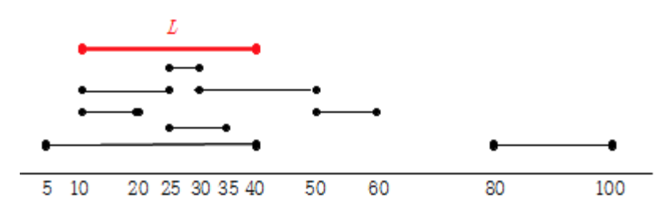

# Gold 2

## 문제
집과 사무실을 통근하는 n명의 사람들이 있다. 각 사람의 집과 사무실은 수평선 상에 있는 서로 다른 점에 위치하고 있다. 임의의 두 사람 A, B에 대하여, A의 집 혹은 사무실의 위치가 B의 집 혹은 사무실의 위치와 같을 수 있다. 통근을 하는 사람들의 편의를 위하여 일직선 상의 어떤 두 점을 잇는 철로를 건설하여, 기차를 운행하려고 한다. 제한된 예산 때문에, 철로의 길이는 d로 정해져 있다. 집과 사무실의 위치 모두 철로 선분에 포함되는 사람들의 수가 최대가 되도록, 철로 선분을 정하고자 한다.

양의 정수 d와 n 개의 정수쌍, (hi, oi), 1 ≤ i ≤ n,이 주어져 있다. 여기서 hi와 oi는 사람 i의 집과 사무실의 위치이다. 길이 d의 모든 선분 L에 대하여, 집과 사무실의 위치가 모두 L에 포함되는 사람들의 최대 수를 구하는 프로그램을 작성하시오.

그림 1. 8 명의 집과 사무실의 위치

그림 1 에 있는 예를 고려해보자. 여기서 n = 8, (h1, o1) = (5, 40), (h2, o2) = (35, 25), (h3, o3) = (10, 20), (h4, o4) = (10, 25), (h5, o5) = (30, 50), (h6, o6) = (50, 60), (h7, o7) = (30, 25), (h8, o8) = (80, 100)이고, d = 30이다. 이 예에서, 위치 10 과 40 사이의 빨간색 선분 L이, 가장 많은 사람들에 대하여 집과 사무실 위치 모두 포함되는 선분 중 하나이다. 따라서 답은 4 이다.

## 입력
입력은 표준입력을 사용한다. 첫 번째 줄에 사람 수를 나타내는 양의 정수 n (1 ≤ n ≤ 100,000)이 주어진다. 다음 n개의 각 줄에 정수 쌍 (hi, oi)가 주어진다. 여기서 hi와 oi는 −100,000,000이상, 100,000,000이하의 서로 다른 정수이다. 마지막 줄에, 철로의 길이를 나타내는 정수 d (1 ≤ d ≤ 200,000,000)가 주어진다.

## 출력
출력은 표준출력을 사용한다. 길이 d의 임의의 선분에 대하여, 집과 사무실 위치가 모두 그 선분에 포함되는 사람들의 최대 수를 한 줄에 출력한다.

## Thinking!!
쉬워보이는데, d의 길이를 가진 선로를 새로 놓을건데,
어떻게 놓아야 최대한 많은 경로를 커버할 수 있느냐

집/회사 좌표: h, o

정렬해서 start = min(h, o), end = max(h, o)

일단 end - start > d 인 사람은,