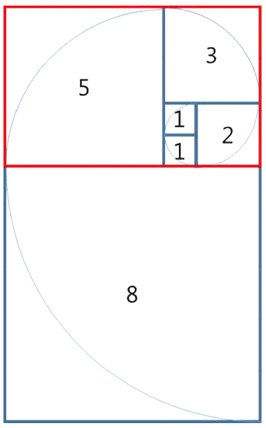

# Silver 5

## 문제
대구 달성공원에 놀러 온 지수는 최근에 새로 만든 타일 장식물을 보게 되었다. 타일 장식물은 정사각형 타일을 붙여 만든 형태였는데, 한 변이 1인 정사각형 타일부터 시작하여 마치 앵무조개의 나선 모양처럼 점점 큰 타일을 붙인 형태였다. 타일 장식물의 일부를 그리면 다음과 같다.

그림에서 타일에 적힌 수는 각 타일의 한 변의 길이를 나타낸다. 타일 장식물을 구성하는 정사각형 타일 한 변의 길이를 안쪽 타일부터 시작하여 차례로 적으면 다음과 같다.

1, 1, 2, 3, 5, 8, ... 

지수는 문득 이러한 타일들로 구성되는 큰 직사각형의 둘레가 궁금해졌다. 예를 들어, 처음 다섯개의 타일이 구성하는 직사각형(위에서 빨간색으로 표시한 직사각형)의 둘레는 26이다.

타일의 개수 N(1 ≤ N ≤ 80)이 주어졌을 때, N개의 타일로 구성된 직사각형의 둘레를 구하는 프로그램을 작성하시오.

## 입력
표준 입력으로 다음 정보가 주어진다. 입력은 한 줄로 구성되며 이 줄에는 타일의 개수를 나타내는 정수 N(1 ≤ N ≤ 80)이 주어진다. 

## 출력
표준 출력으로 N 개의 타일이 구성하는 타일 장식물 직사각형의 둘레를 출력한다. 

64비트 정수형인 “long long” 자료형을 써야할 수 있음

| 번호 | 배점 | 제한 |
| --- | --- | --- |
| 1 | 21 | N ≤ 7 |
| 2 | 53 | N ≤ 40 |
| 3 | 26 | 원래의 제약조건 이외에 아무 제약조건이 없다 (이 경우 64비트 정수형인 “long long” 자료형을 써야할 수 있음) |

## Thinking!!
그러니까 메모리 관리 잘하라는 뜻임 ㅇㅇ;;

일단 문제가 요구하는건 입력값 N에 대하여 N번 실행했을 때 전체 타일의 겉넓이를 구하는 것

즉, N회의 결과 값이 w, 그 전 값이 y 라고 했을 때
2*((y+w) + w) => 2(2w+y) => 4w + 2y