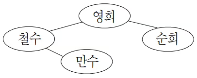
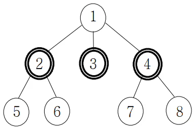

## Gold 3

## 문제
페이스북, 트위터, 카카오톡과 같은 사회망 서비스(SNS)가 널리 사용됨에 따라, 사회망을 통하여 사람들이 어떻게 새로운 아이디어를 받아들이게 되는가를 이해하는 문제가 중요해졌다. 사회망에서 사람들의 친구 관계는 그래프로 표현할 수 있는데,  이 그래프에서 사람은 정점으로 표현되고, 두 정점을 잇는 에지는 두 정점으로 표현되는 두 사람이 서로 친구 관계임을 표현한다. 

예를 들어, 철수와 영희, 철수와 만수, 영희와 순희가 서로 친구 관계라면 이를 표현하는 친구 관계 그래프는 다음과 같다. 

친구 관계 그래프를 이용하면 사회망 서비스에서 어떤 새로운 아이디어가 전파되는 과정을 이해하는데 도움을 줄 수 있다. 어떤 새로운 아이디어를 먼저 받아들인 사람을 얼리 아답터(early adaptor)라고 하는데, 사회망 서비스에 속한 사람들은 얼리 아답터이거나 얼리 아답터가 아니다. 얼리 아답터가 아닌 사람들은 자신의 모든 친구들이 얼리 아답터일 때만 이 아이디어를 받아들인다. 

어떤 아이디어를 사회망 서비스에서 퍼뜨리고자 할 때, 가능한 한 최소의 수의 얼리 아답터를 확보하여 모든 사람이 이 아이디어를 받아들이게 하는  문제는 매우 중요하다. 

일반적인 그래프에서 이 문제를 푸는 것이 매우 어렵다는 것이 알려져 있기 때문에, 친구 관계 그래프가 트리인 경우, 즉 모든 두 정점 사이에 이들을 잇는 경로가 존재하면서 사이클이 존재하지 않는 경우만 고려한다. 

예를 들어, 8명의 사람으로 이루어진 다음 친구 관계 트리를 생각해보자. 2, 3, 4번 노드가 표현하는 사람들이 얼리 아답터라면, 얼리 아답터가 아닌 사람들은 자신의 모든 친구가 얼리 아답터이기 때문에 새로운 아이디어를 받아들인다.

친구 관계 트리가 주어졌을 때, 모든 개인이 새로운 아이디어를 수용하기 위하여 필요한 최소 얼리 어답터의 수를 구하는 프로그램을 작성하시오.

## 입력
첫 번째 줄에는 친구 관계 트리의 정점 개수 N이 주어진다. 단, 2 ≤ N ≤ 1,000,000이며, 각 정점은 1부터 N까지 일련번호로 표현된다. 두 번째 줄부터 N-1개의 줄에는 각 줄마다 친구 관계 트리의 에지 (u, v)를 나타내는 두 정수 u와 v가 하나의 빈칸을 사이에 두고 주어진다. 

## 출력
주어진 친구 관계 그래프에서 아이디어를 전파하는데 필요한 얼리 아답터의 최소 수를 하나의 정수로 출력한다.

## Thinking!!
트리에서 DP를 구현하기 위해 참고한 코드

    #include <iostream>
    #include <vector>
    #include <algorithm>
    
    using namespace std;
    
    int N, R, Q;
    int dp[100001];
    bool visit[100001];
    vector< vector<int> >node;
    
    int dfs(int cur) {
        // 이미 방문한 곳은 가지 않도록 한다.
        if (visit[cur]) return dp[cur];
        visit[cur] = true;		
    
        // cur와 인접한 노드를 방문한다.
        for (auto next : node[cur]) {
            // 이미 방문한 곳 X
            if (visit[next]) continue;
            dp[cur] = dp[cur] + dfs(next);
        }
        return dp[cur];
    }
    
    
    int main() {
    
        ios::sync_with_stdio(0);
        cin.tie(0);
        cout.tie(0);
    
        cin >> N >> R >> Q;
        node.resize(N + 1);
    
        for (int i = 0; i < N - 1; i++) {
            int u, v;
            cin >> u >> v;
            node[u].push_back(v);
            node[v].push_back(u);
        }
    
        for (int i = 1; i <= N; i++) 
            dp[i] = 1;
        
        dfs(R);
        vector<int> query;
        
        for (int i = 0; i < Q; i++) {
            int U;
            cin >> U;
            cout << dp[U] << '\n';
        }
        return 0;
    }

## 1차 시도
저번에도 dp에서 재귀로 메모리 플로우 났는데, 이번에도 같은 에러가 난다
알고리즘은 정상이니, 방법만 단순 반복문으로 바꿔야할 것 같다.

    N = int(input())
    nodes = [[] for _ in range(N+1)]
    dp = [[0] * 2 for _ in range(N+1)]
    
    for i in range(N-1):
        a, b = map(int, input().split())
    
        nodes[a].append(b)
        nodes[b].append(a)
    
    def dfs(u, parent):
        dp[u][0] = 0   # u가 일반인
        dp[u][1] = 1   # u가 얼리 아답터 (본인 카운트)
    
        for v in nodes[u]:
            if v == parent:
                continue
    
            dfs(v, u)
    
            dp[u][0] += dp[v][1]
            dp[u][1] += min(dp[v][0], dp[v][1])
    
    
    dfs(1, 0)
    answer = min(dp[1][0], dp[1][1])
    print(answer)

## 또 하나
    dp = [[0] * 2 for _ in range(N + 1)]
    ->
    dp0 = [0] * (N + 1)  # 일반인
    dp1 = [0] * (N + 1)  # 얼리
이런식으로 2차원 배열을 쓰는 것 보다 1차원 배열 두개로 나누는 게, 캐시적으로나
메모리적으로 더 용이하다고 한다.

그러면 루프에서도 

    for u in reversed(order):
        dp0[u] = 0
        dp1[u] = 1
        for v in nodes[u]:
            if v == parent[u]:
                continue
            dp0[u] += dp1[v]
            dp1[u] += dp0[v] if dp0[v] < dp1[v] else dp1[v]
이런식으로 분리해서 담당하면 되고.