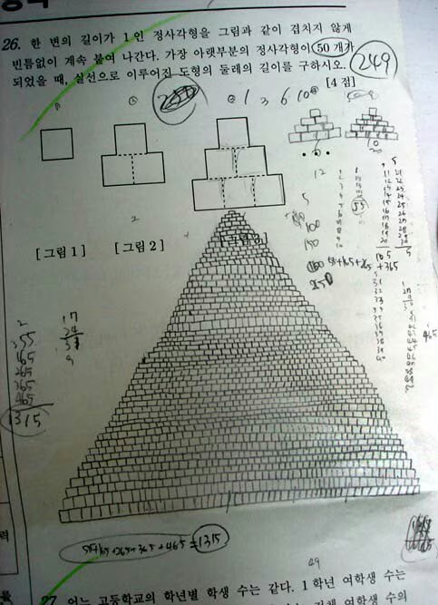
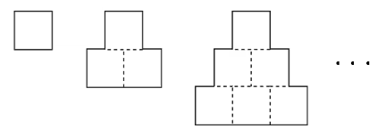

## 문제
성원이는 수학을 정말 못 하는 고등학생이다. 수학을 못하는 대신 근성과 팔 힘이 뛰어난 성원이는 수학 시험에서 수학 지식을 사용하지 않고 근성과 체력을 사용해 문제를 푼다. 지난 시험에서는 아래 사진에 나와있는 문제를 근성과 체력을 사용해 열심히 풀었지만 사진에서 볼 수 있듯이 틀려버리고 말았다!

결국 이 문제는 틀려버렸지만 성원이는 여전히 자신의 체력에 강한 자신감을 갖고 있다. 어떤 어려운 문제가 나와도 이런 식으로 근성과 체력을 사용하면 다 풀 수 있으니 이 방법은 최고의 방법이라고 생각하고 있다.

성원이의 친구 형석이는 근성과 체력으로 수학 문제를 푸는 것은 굉장히 무식한 방법이라고 생각한다. 형석이는 수학을 공부하면 문제를 훨씬 빨리 풀 수 있다는 것을 알려주기 위해 위 사진에 나와있는 문제를 갖고 성원이와 퀴즈 내기를 하기로 했다. 위 사진의 문제를 다시 정리하면 아래와 같다.

"한 변의 길이가 1인 정사각형을 아래 그림과 같이 겹치지 않게 빈틈없이 계속 붙여 나간다. 가장 아랫부분의 정사각형이 n개가 되었을 때, 실선으로 이루어진 도형의 둘레의 길이를 구하시오."

가장 아랫부분의 정사각형 개수가 주어지면 그에 해당하는 답을 출력하는 프로그램을 만들어 형석이를 도와주자!

## 입력
첫 번째 줄에 가장 아랫부분의 정사각형 개수 n이 주어진다. (1 ≤ n ≤ 109)

## 출력
첫 번째 줄에 형석이가 말해야 하는 답을 출력한다.

## Thinking!!
오랜만에 수학문제,,, 그니까 지금 필요한 건 사각형 갯수 * 변 - 만들어진 도형의 둘레의 길이

원래 N(N+1)/2가 1부터 N까지 늘어나는 등차수열의 합이라는 것 만 기억나는데
둘레의 길이만 구하면 되겠네

일단 실선의 길이의 합은
1층이면 0 2층이면 2 3층이면 6 4층이면 12 0 2 6 12 음 전혀 모르겠군

그럼 둘레는?
1층이면 4 2층이면 8 3층이면 12? 둘레는 N*4구나?

그럼 정답은? (N(N+1)/2)*4 - 4N 끝. EZ

어? 뭐야 점선부분 길이가 아니고 실선부분 길이 구하는거넹? ㅋㅋ;;
그럼 그냥 4N이 정답이넹 ㅎㅎ;;

