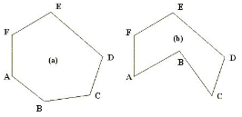
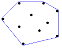

# Platinum 5

## 문제
다각형의 임의의 두 꼭짓점을 연결하는 선분이 항상 다각형 내부에 존재하는 다각형을 볼록 다각형이라고 한다. 아래 그림에서 (a)는 볼록 다각형이며, (b)는 볼록 다각형이 아니다.

조금만 생각해 보면 다각형의 모든 내각이 180도 이하일 때 볼록 다각형이 된다는 것을 알 수 있다. 편의상 이 문제에서는 180도 미만인 경우만을 볼록 다각형으로 한정하도록 한다.

2차원 평면에 N개의 점이 주어졌을 때, 이들 중 몇 개의 점을 골라 볼록 다각형을 만드는데, 나머지 모든 점을 내부에 포함하도록 할 수 있다. 이를 볼록 껍질 (CONVEX HULL) 이라 한다. 아래 그림은 N=10인 경우의 한 예이다.

점의 집합이 주어졌을 때, 볼록 껍질을 이루는 점의 개수를 구하는 프로그램을 작성하시오.

## 입력
첫째 줄에 점의 개수 N(3 ≤ N ≤ 100,000)이 주어진다. 둘째 줄부터 N개의 줄에 걸쳐 각 점의 x좌표와 y좌표가 빈 칸을 사이에 두고 주어진다. 주어지는 모든 점의 좌표는 다르다. x좌표와 y좌표의 범위는 절댓값 40,000을 넘지 않는다. 입력으로 주어지는 다각형의 모든 점이 일직선을 이루는 경우는 없다.

## 출력
첫째 줄에 볼록 껍질을 이루는 점의 개수를 출력한다.

볼록 껍질의 변에 점이 여러 개 있는 경우에는 가장 양 끝 점만 개수에 포함한다.

## Thinking!!
내각이 180도 이상이 아니고, 가장 밖에 있는 점이라는걸 어떻게 구해야할까?
<< 볼록껍질 알고리즘이라는 거 자체가 있네.

볼록껍질을 구하는 다양한 알고리즘 중, Graham Scan의 동작을 보자

1. 주어진 점들을 반시계방향으로 정렬하고, 정렬된 순서대로 점들을 탐색한다.

 

2. stack에 1번 점과 2번 점을 push한다.

 

3. 3번 ~ N번째 점까지 아래의 과정을 반복할 것이다.

 

만약 stack의 최상단에 있는 두 점을 이은 직선 l에 대해, 현재 탐색하는 점이 l의 왼쪽에 존재한다면 stack에 push한다.
그렇지 않다면 stack을 1번 pop하고 위 조건을 다시 확인한다.

4. 최종적으로 탐색이 끝나면 stack에는 Convex Hull을 구성하는 점들이 포함되어 있다.

일단 위 조건중에 2까지는 구햇는데, 3번 왼/오른쪽 판단을 하는것도 또 찾아봤음

    def side(a, b, p):
        ax, ay = a
        bx, by = b
        px, py = p
    
        cross = (bx - ax) * (py - ay) - (by - ay) * (px - ax)
    
        if cross > 0:
            return "left"   # 왼쪽
        elif cross < 0:
            return "right"  # 오른쪽
        else:
            return "collinear"  # 일직선

이런식으로 외적 부호 판단을 하면 된다고 한다.

한번 heap을 써보고싶어서 써봤는데, 힙은 별론듯

## 첫 번째 풀이
    import math
    import sys
    
    input = sys.stdin.readline
    
    N = int(input())
    points = []
    stack = []
    
    def side(a, b, p):
        ax, ay = a
        bx, by = b
        px, py = p
    
        cross = (bx - ax) * (py - ay) - (by - ay) * (px - ax)
    
        if cross > 0:
            # 왼쪽이면 스택에 push
            stack.append(p)
            return
    
    
    for _ in range(N):
        a, b = map(int, input().split())
        points.append([a, b, 0])  # 리스트로 저장
    
    cx = sum(p[0] for p in points) / N
    cy = sum(p[1] for p in points) / N
    
    for i in range(N):
        points[i][2] = math.atan2(points[i][1] - cy, points[i][0] - cx)
    
    points.sort(key=lambda p: p[2])
    
    # 처음 두 점 push
    stack.append((points[0][0], points[0][1]))
    stack.append((points[1][0], points[1][1]))
    
    for i in range(2, N):
        x = stack.pop()
        y = stack.pop()
        stack.append(x)
        stack.append(y)
    
        p = [points[i][0], points[i][1]]
        side(x, y, p)
    
    print(len(stack))

일단 중심점을 기준으로 정렬하는게 틀렸고, 가장 아래(x, y 최소값으로)점을 pivot으로 결정
side함수 대신, 20149번(선분교차)에서 쓰인 ccw로 대체.

    while len(stack) >= 2 and ccw(stack[-2], stack[-1], p) <= 0:
이 부분이, 새 점 p를 넣기 전에, 마지막 두 점과 함께 보면 
오른쪽으로 꺾이거나 일직선이면 그 마지막 점은 볼록껍질을 깨니까
계속 pop해서 지운다