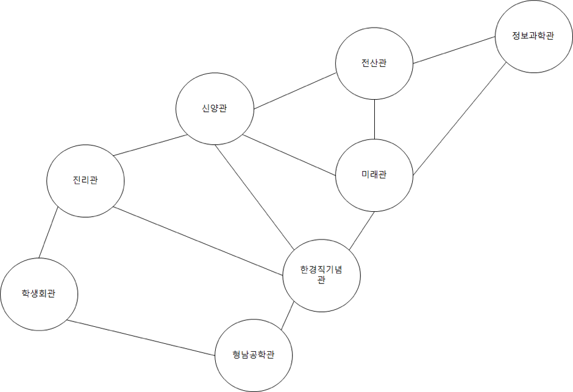

문제
숭실 대학교 정보 과학관은 유배를 당해서  캠퍼스의 길 건너편에 있다. 그래서 컴퓨터 학부 학생들은 캠퍼스를 ‘본대’ 라고 부르고 정보 과학관을 ‘정보대’ 라고 부른다. 준영이 또한 컴퓨터 학부 소속 학생이라서 정보 과학관에 박혀있으며 항상 꽃 이 활짝 핀 본 대를 선망한다. 어느 날 준영이는 본 대를 산책하기로 결심하였다. 숭실 대학교 캠퍼스 지도는 아래와 같다.

(편의 상 문제에서는 위 건물만 등장한다고 가정하자)

한 건물에서 바로 인접한 다른 건물로 이동 하는 데 1분이 걸린다. 준영이는 산책 도중에 한번도 길이나 건물에 멈춰서 머무르지 않는다. 준영이는 할 일이 많아서 딱 D분만 산책을 할 것이다. (산책을 시작 한 지 D분 일 때, 정보 과학관에 도착해야 한다.) 이때 가능한 경로의 경우의 수를 구해주자.

## 입력
D 가 주어진다 (1 ≤ D ≤ 1,000,000,000) 

## 출력
가능한 경로의 수를 1,000,000,007로 나눈 나머지를 출력한다.

## Thinking!!!
인접행렬(각 원소에서 도착할 수 있는 경우의 수) A 에 대해서 
A^D[i][j] = i에서 j로 정확히 D번 이동하는 경우의 수를 구하려면 
정확히 D번 이동하는 것에 대해 제곱, 즉
A ^ D 값을 통해서 알 수 있다. 이는 행렬 곱이 중간 노드를 거치는 
모든 경로를 합하는 연산이기 때문이다.

해당 문제에는 D 값이 최대 10억까지로 굉장히 크기 떄문에, 분할 정복 즉,
빠른 거듭제곱으로 해결한다. (D번을 곱하는게 아니고, 반으로 쪼개는 식으로)
A^8 = (A^4)^2 -> A^4 = (A^2)^2 -> A^2 = A × A
D, 즉 8번의 계산을 3번으로 줄일 수 있게 됨.

이때 일반화를 통해 D가 짝수인지 홀수인지에 따라
짝수라면 A^D = (A^(D/2)) × (A^(D/2))
홀수라면 A^D = A × (A^(D-1)) 로 처리할 수 있음.

이걸 코드로 치환해보면

    pow(A, D):
        if D == 1:
            return A
    
        half = pow(A, D//2)
    
        if D 짝수:
            return half × half
        else:
            return half × half × A
와 같은 느낌으로 볼 수 있다.

이렇게 값을 구할 때, 매 곱셈마다 모듈러를 적용하면 원하는 결과값을
도출해 낼 수 있다.
