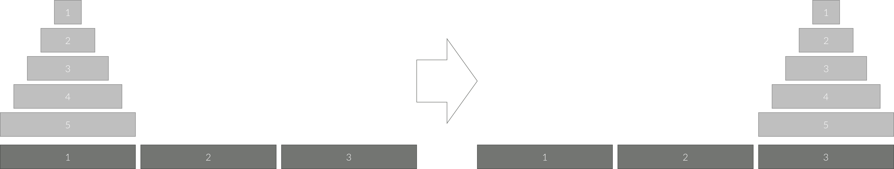

# Gold 5

## 문제
세 개의 장대가 있고 첫 번째 장대에는 반경이 서로 다른 n개의 원판이 쌓여 있다. 각 원판은 반경이 큰 순서대로 쌓여있다. 이제 수도승들이 다음 규칙에 따라 첫 번째 장대에서 세 번째 장대로 옮기려 한다.

한 번에 한 개의 원판만을 다른 탑으로 옮길 수 있다.
쌓아 놓은 원판은 항상 위의 것이 아래의 것보다 작아야 한다.
이 작업을 수행하는데 필요한 이동 순서를 출력하는 프로그램을 작성하라. 단, 이동 횟수는 최소가 되어야 한다.

아래 그림은 원판이 5개인 경우의 예시이다.

## 입력
첫째 줄에 첫 번째 장대에 쌓인 원판의 개수 N (1 ≤ N ≤ 20)이 주어진다.

## 출력
첫째 줄에 옮긴 횟수 K를 출력한다.

두 번째 줄부터 수행 과정을 출력한다. 두 번째 줄부터 K개의 줄에 걸쳐 두 정수 A B를 빈칸을 사이에 두고 출력하는데, 이는 A번째 탑의 가장 위에 있는 원판을 B번째 탑의 가장 위로 옮긴다는 뜻이다.

## Thinking!!
너무 깊게 들어가지 마라, 깊은 연산은 컴퓨터가 해줄거라는 힌트

배열로 만들어서 pop을 하면 되지않을까? 그리고 세 번째 장대로 옮겨야 하기 때문에
마지막이 2번으로끝나면 첫 시도를 다른 장대로 하면 되지않을까?

일단 실행한 횟수는 함수의 실행횟수로 세면 될 거 같고,
시행 기록은 딕셔너리로 저장해야하나?

--------------------------------

재귀함수의 포인트는 함수(N)에 대하여 함수(N-1)인 경우를 발견할 수 있는가?
위 원판의 움직임에 대해서 N이라고 할 때, N-1인 경우를 통해 결과값이 도출되게끔 설계해야 한다.

## 1차 풀이

    N = int(input())
    
    start_val = []
    to_val = []
    
    def move(start, to):
        start_val.append(start)
        to_val.append(to)
    
    def hanoi(n, start, to, via):
        if n == 1:
            move(start, to)
        else:
            hanoi(n - 1, start, via, to)
            move(start, to)
            hanoi(n - 1, via, to, start)
    
    hanoi(N, 1,3, 2)
    
    print(len(start_val))
    for i in range(len(start_val)):
        print(start_val[i], to_val[i])

문제 풀이는 https://shoark7.github.io/programming/algorithm/tower-of-hanoi
해당 블로그의 내용을 이해하고 사용하는 방식으로 했다.
재귀함수의 중점인 어떻게해야 재귀함수로 설계할지 생각해볼 기회였다.

## 2차 풀이(최적화)

    N = int(input())
    result = []
    
    def hanoi(n, start, to, via):
        if n == 1:
            result.append((start, to))
        else:
            hanoi(n - 1, start, via, to)
            result.append((start, to))
            hanoi(n - 1, via, to, start)
    
    hanoi(N, 1, 3, 2)
    
    print(len(result))
    for a, b in result:
        print(a, b)

딕셔너리를 활용하고, move함수를 제거하여 더 간단하게 처리했다.

코드 자체의 길이는 줄었지만, 시간 자체의 변화는 없다.
시간 최적화가 가능할까?

위 두 코드의 실행 시간은 약 1080ms 정도

## 3차 풀이
print 자체가 느리다는 걸 깨달았다.
이 print를 sys.stdout.write()를 사용하면 훨씬 빨라진다.
(주의할 점, write()에는 문자열만 가능하기 떄문에 f"{a} {b}\n" 같이 변환시켜줘야 한다.)
    
    import sys
    
    N = int(input())
    result = []
    
    def hanoi(n, start, to, via):
        if n == 1:
            result.append((start, to))
        else:
            hanoi(n - 1, start, via, to)
            result.append((start, to))
            hanoi(n - 1, via, to, start)
    
    hanoi(N, 1, 3, 2)
    
    print(len(result))
    for a, b in result:
        sys.stdout.write(f"{a} {b}\n")

해당 코드의 실행시간은 648ms

## 4차 시도

4차 시도는 gpt가 알려주는 제일 최적화 시켜보기! 라는 느낌

    import sys
    input = sys.stdin.read
    print = sys.stdout.write  # 얘가 진짜 빠름
    
    N = int(input())
    result = []
    
    def hanoi(n, start, to, via):
        if n == 1:
            result.append(f"{start} {to}\n")
        else:
            hanoi(n-1, start, via, to)
            result.append(f"{start} {to}\n")
            hanoi(n-1, via, to, start)
    
    hanoi(N, 1, 3, 2)
    print(f"{len(result)}\n")
    print("".join(result))

애초에 넣을때 부터 문자열로 넣어버리고 출력을 join으로 한번에 시켜버리는 느낌.

이 코드의 실행시간은 무려!!! 396ms 밖에 되지않는다!!

무려 내 처음 코드의 2/5, 3차 시도의 절반 수준으로 줄어들었다...