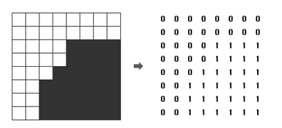

# Silver 1

## 문제
흑백 영상을 압축하여 표현하는 데이터 구조로 쿼드 트리(Quad Tree)라는 방법이 있다. 흰 점을 나타내는 0과 검은 점을 나타내는 1로만 이루어진 영상(2차원 배열)에서 같은 숫자의 점들이 한 곳에 많이 몰려있으면, 쿼드 트리에서는 이를 압축하여 간단히 표현할 수 있다.

주어진 영상이 모두 0으로만 되어 있으면 압축 결과는 "0"이 되고, 모두 1로만 되어 있으면 압축 결과는 "1"이 된다. 만약 0과 1이 섞여 있으면 전체를 한 번에 나타내지를 못하고, 왼쪽 위, 오른쪽 위, 왼쪽 아래, 오른쪽 아래, 이렇게 4개의 영상으로 나누어 압축하게 되며, 이 4개의 영역을 압축한 결과를 차례대로 괄호 안에 묶어서 표현한다

위 그림에서 왼쪽의 영상은 오른쪽의 배열과 같이 숫자로 주어지며, 이 영상을 쿼드 트리 구조를 이용하여 압축하면 "(0(0011)(0(0111)01)1)"로 표현된다. N ×N 크기의 영상이 주어질 때, 이 영상을 압축한 결과를 출력하는 프로그램을 작성하시오.

## 입력
첫째 줄에는 영상의 크기를 나타내는 숫자 N 이 주어진다. N 은 언제나 2의 제곱수로 주어지며, 1 ≤ N ≤ 64의 범위를 가진다. 두 번째 줄부터는 길이 N의 문자열이 N개 들어온다. 각 문자열은 0 또는 1의 숫자로 이루어져 있으며, 영상의 각 점들을 나타낸다.

## 출력
영상을 압축한 결과를 출력한다.

## Thinking!!
저번에 풀었던 색종이만들기랑 같은 느낌이지만 출력만 바꾸면 될까?

## 1차 시도(메모리 초과)

    n, r, c = map(int, input().split())
    
    N = 2**n
    Z = [[0]*N for _ in range(N)] # 일단 빈 배열을 만들어
    
    count = 0
    
    def z(arr, a, b, length):
    
        global count, r, c
    
        if length == 2:
            for i in range(a, a+2):
                for j in range(b, b+2):
                    arr[i][j] = count
                    if j == r and i == c:
                        print(arr[i][j])
                        break
                    count += 1
            return
        else:
            half = length // 2
    
            z(arr, a, b, half)
            z(arr, a+half, b, half)
            z(arr, a, b+half, half)
            z(arr, a+half, b+half, half)
    
    z(Z, 0, 0, N)

배열을 너무 크게 사용하기 때문에 메모리 초과가 나타난다...
배열을 안쓰고 푸는 방법을 생각해야 할 것 같다

## 2차 시도!!(시간 초과)

    n, r, c = map(int, input().split())
    
    N = 2**n
    
    count = 0
    
    def z(a, b, depth):
    
        global count, r, c
    
        if depth == 2:
            for i in range(a, a+2):
                for j in range(b, b+2):
                    if j == r and i == c:
                        print(count)
                        break
                    count += 1
            return
        else:
            half = depth // 2
    
            z(a, b, half)
            z(a+half, b, half)
            z(a, b+half, half)
            z( a+half, b+half, half)
    
    z(0, 0, N)

끄아아악!! 이번엔 시간초과!!!
아무래도 전체탐색을 하기때문에 시간초과가 일어나는 것 같다
처음 아이디어에 생각했던 것 처럼 사분면을 나눠서 계산해야할 것 같은데