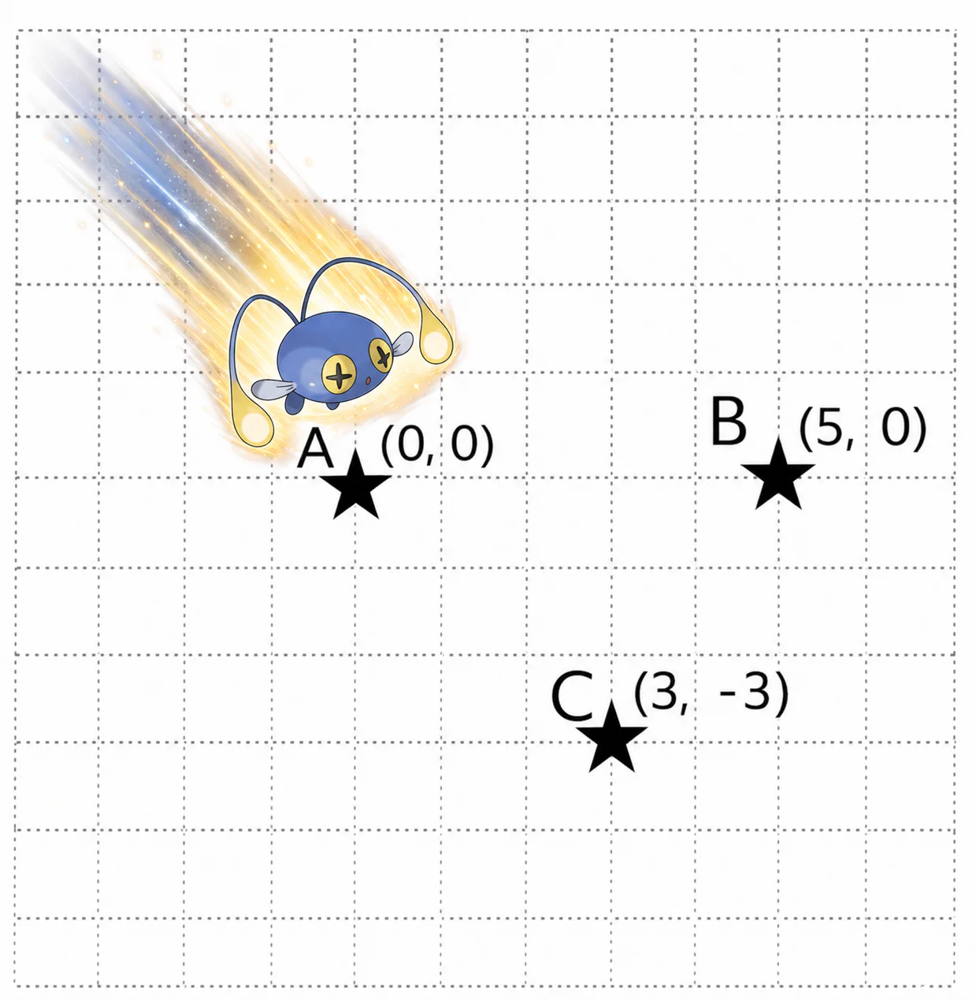

# Platinum 2

## 문제
https://www.acmicpc.net/problem/1006
화성에서 바라보는 밤하늘에는 밝게 빛나는 많은 별이 있다.

이 별에 살고 있는 대장장이 토르비욘은 고정된 카메라로 매일 밤 자정에 하늘 사진을 찍고 있다가, 하늘에서 1, 2, ..., R-L+1마리의 초라기가 날아오는 것을 깨달았다!

다행히도, 당신은 지도 제작자 수아에게 부탁해 대피로를 확보하려고 한다. 문제는, 수아는 사탕을 주지 않으면 도와주지 않는다는 점이다.

화성에는 총 
$N$개의 연구소가 x축 위에 차례로 놓여 있다. 현재 
$1$번 연구소에는 당신이 연구하고 있으며, 
$2$번부터 
$N-1$번 연구소에도 각각 1명씩 연구원이 있다. 사탕은 공짜가 아니므로, 당신은 특공대가 상주하는 
$N$번 연구소로 도망가는 길에 연구원들을 몇 명 같이 대피시키고 비용을 엔빵하려고 한다.

수아는 오른쪽으로 순간 이동할 수 있는 경로를 총 
$M$가지 알고 있다. 
$i$번째 경로는 
$u_i$번 연구소에서 
$v_i$번 연구소로 이어지며, 이 길로 순간이동을 하려면 수아에게 
$2^i$개의 사탕을 지불해야 한다. (
$1 \le i \le M$)

이동하는 중 방문한 연구소 중 
$1$번과 
$N$번을 제외한 연구소의 개수를 
$x$라고 하자. 이때 당신은 같이 대피한 
$x$명의 사람과 함께 총 
$x+1$명이서 이동에 든 비용을 균등하게 나눈 만큼의 사탕을 지불해야 한다. 당연히 당신은 지불하는 사탕의 개수를 최소화하고 싶다. 이동 중 방문한 연구소에 있는 모든 연구원은 함께 대피한다.

대체 얼마나 많은 사탕을 사야 하는 것인가? 사탕이 너무 많아 세기가 힘들 지경이므로, 당신이 지불해야 하는 사탕 개수를 
$T$라고 할 때 
$\lfloor \log_2 T \rfloor$를 구해 보자.

## 입력
첫째 줄에 연구소의 개수 
$N$과 사용할 수 있는 경로의 개수 
$M$이 공백으로 구분되어 주어진다.

이어지는 
$M$개의 줄에, 차례대로 두 정수 
$u_i$, 
$v_i$가 공백으로 구분되어 주어진다.

## 출력
문제에서 요구하는 정답을 출력한다.

## 제한
 
$ 2 \le N \le 300\,000 $
 
$ 1 \le M \le 300\,000 $ 
 
$ 1 \le u_i < v_i \le N$ (
$1 \le i \le M$)
 
$1$번 연구소에서 
$N$번 연구소로 이동할 수 있는 입력만 주어진다.
서로 다른 두 연구소 사이에 경로가 여럿 존재할 수 있음에 유의하라.
### 예제 입력 1 
4 3
1 2
2 3
3 4
### 예제 출력 1 
2
 
$1$번 경로 
$\rightarrow$ 
$2$번 경로 
$\rightarrow$ 
$3$번 경로의 순서로 이용하면, 지불해야 하는 사탕의 개수는 
$2^1 + 2^2 + 2^3 = 14$개가 되어, 3명이서 균등하게 나눈다면 각자 
 
$14 \over 3$개의 사탕을 지불해야 한다.

이 경우, 정답은 
 
$\lfloor \log_2 {14 \over 3} \rfloor = 2$이다.

### 예제 입력 2 
4 4
1 2
2 3
1 4
3 4
### 예제 출력 2 
2
 
$1$번 경로 
$\rightarrow$ 
$2$번 경로 
$\rightarrow$ 
$4$번 경로의 순서로 이용하면, 지불해야 하는 사탕의 개수는 
$2^1 + 2^2 + 2^4 = 22$개가 되어, 3명이서 균등하게 나눈다면 각자 
 
$22 \over 3$개의 사탕을 지불해야 한다.

이 경우, 정답은 
 
$\lfloor \log_2 {22 \over 3} \rfloor = 2$이다.

 
$3$번 경로만 사용해도 
$4$번 연구소에 도달할 수 있으나, 이 경우에는 지불해야 하는 사탕의 개수가 
$2^3 = 8$개로 문제에서 구하는 값이 
$\lfloor \log_2 8 \rfloor = 3$이 되어 최적이 아님에 유의하여라.