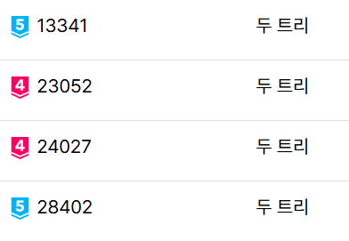

## 문제
https://www.acmicpc.net/problem/23052
백준 온라인 저지에는 "두 트리"라는 이름의 문제가 4개 있다. 대회가 너무 쉬울 것 같다는 검수진의 항의를 받은 한 출제자는 가장 어려운 두 트리를 더 어렵게 만들기로 했다.

 
$N$개의 정점과 서로 다른 
$2(N-1)$개의 간선으로 이루어진 그래프가 주어진다. 각 정점은 
$1$번부터 
$N$번까지, 각 간선은 
$1$번부터 
$2(N-1)$번까지 번호가 부여되어 있다. 
$i$번 간선은 
$A_i$번 정점과 
$B_i$번 정점을 서로 연결한다. (
$1\le i\le 2(N-1)$)

각 간선을 빨강 혹은 파랑으로 칠하자. 빨간 간선으로 이루어진 그래프와 파란 간선으로 이루어진 그래프가 각각 트리가 되도록 간선을 칠할 수 있는지 판별하라.

## 입력
첫째 줄에 정수 
$N$이 주어진다.

둘째 줄부터 
$2(N-1)$개의 줄에 걸쳐 그래프의 간선이 주어진다. 
$(i+1)$번째 줄에는 두 정수 
$A_i$, 
$B_i$가 공백으로 구분되어 주어진다.

각 간선이 연결하는 정점 쌍은 모두 다르다.

## 출력
만일 불가능하다면 첫째 줄에 NO를 출력하라.

만약 가능하다면 첫째 줄에 YES를 출력하라. 이후 둘째 줄에 R과 B로 이루어진 길이 
$2(N-1)$의 문자열을 출력하라. 이 문자열의 
$i$번째 문자가 R이라는 것은 
$i$번 간선을 빨강으로 칠해야 함을, B라는 것은 파랑으로 칠해야 함을 의미한다. (
$1\le i\le 2(N-1)$)

## 제한
 
$4\le N\le 100\,000$ 
 
$1 \le A_i, B_i \le N$ (
$1 \le i \le 2(N-1)$)
 
$A_i \ne B_i$ (
$1 \le i \le 2(N-1)$)
 
$\left\{ A_i,B_i \right\}\ne\left\{ A_j,B_j \right\}$ (
$1\le i<j\le 2(N-1)$)
### 예제 입력 1 
4
1 2
1 3
1 4
2 3
2 4
3 4
### 예제 출력 1 
YES
RBBRBR
### 예제 입력 2 
5
1 5
3 5
3 4
4 5
2 3
2 5
1 2
1 3
### 예제 출력 2 
YES
BRRBBBRR
## 예제 입력 3 
8
1 2
1 3
2 3
2 4
3 5
4 5
4 6
4 7
4 8
5 6
5 7
5 8
6 7
7 8
### 예제 출력 3 
NO